# SkinDiagnosticAI; Detecting Skin Cancer with Low cost devices
## Project: __Feasibility study__ with open source data and __PyClass__ workbench for classyffication of medical images
      
Author: __Pawel Rosikiewicz, Product Owner & Lead Developer__  
Contact: prosikiewicz@gmail.com    
License: __MIT__         
Copyright (C) 2021.06.14 Pawel Rosikiewicz  

 

---
## __OPEN SOURCE PROJECT__
---

Skin  Diagnostic AI is an open source project created to develop application for medical specialists, and patients that will help identifying potential skin cancer with low cost devices, and collect dermatoscopic images for medical community. It will also help to patients to store their images in easy and accessible way on personal devices, allow remote communication with the doctor, provide preliminary diagnosis, such as cancer rrisk assesment. Furthermore, SkinDiagnosticAI application will allow, collecting, clustering and storing mutlitple images from the same patient, or time, thus allowing for faster, and more speciffic patient-doctor interaction in a limited time-span. 

More info on SkinDiagnosticAI project: https://simpleai.ch/skin-diagnostic-ai/

 

---
## __ABOUT THE PROJECT__
---

 

### __Product Idea__

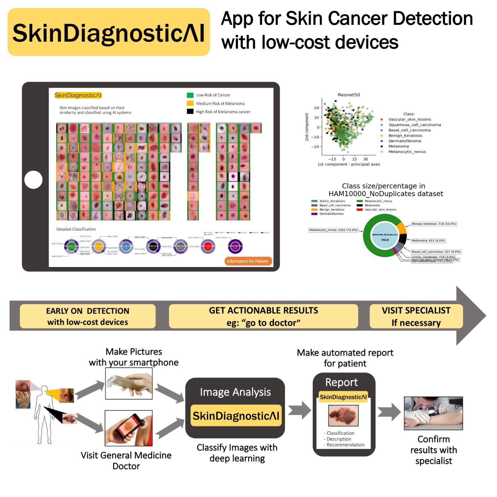

### __Proejct Goals__
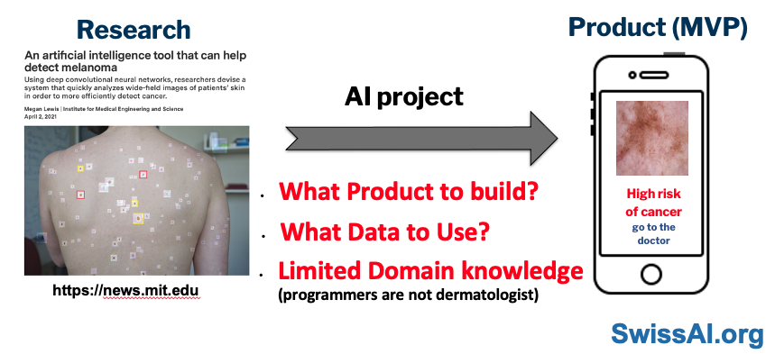

### __Team, advisors, and partners__

### __Development Process__

 

---
## __TECHNOLOGY__
---

 

### __PyClass__ - I created a package for medical image classyfication with pre-trained models

__PyClass provides several dasboards for EDA and model selection__

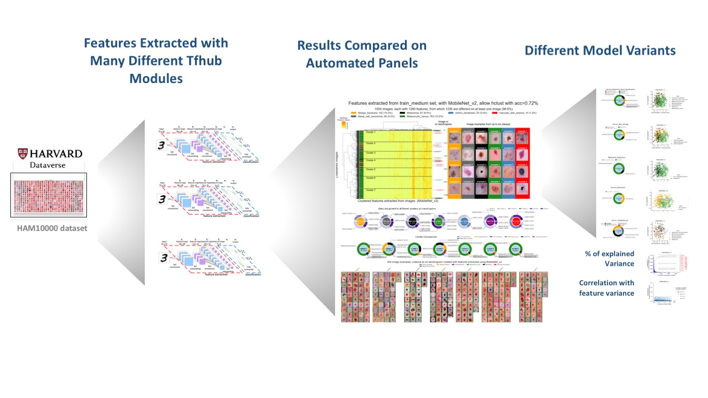

__help organizing files__

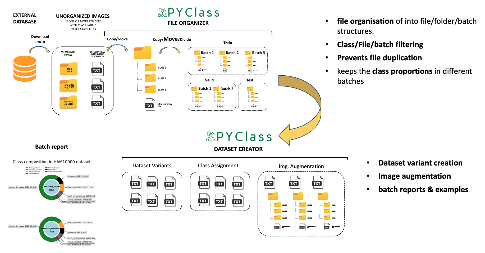

__and selecting models__

__Visual part was very important to allow to non-specialist to access and evaluate the data__
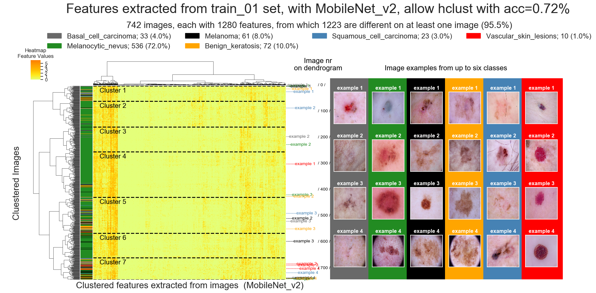

---
## __RESEARCH__
---

### __DATASET__
I used __HAM10000 Dataset__ Provided by Harvard Dataverse, with over 10000 dermatoscopic images, classified with at least two specialist, and biopsy (>50% of images), and follow up examinations.

### __MODELS__
I evaluated over 5000 different models, with different value propositon to potential users and pateints. 

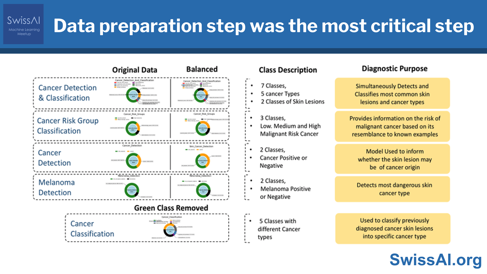

### __RESULT__ - EXAMPLES
for more details see links on www.SimpleAI.ch and slides below in feasibility study section

### __CHALLENGES__ - EXAMPLES

__Duplicates in the dataset__

__Building the PyClass__ - I used a different dataset with easily recognisable features to create the system, in ortser to avoid "silly problems" such as coding errors

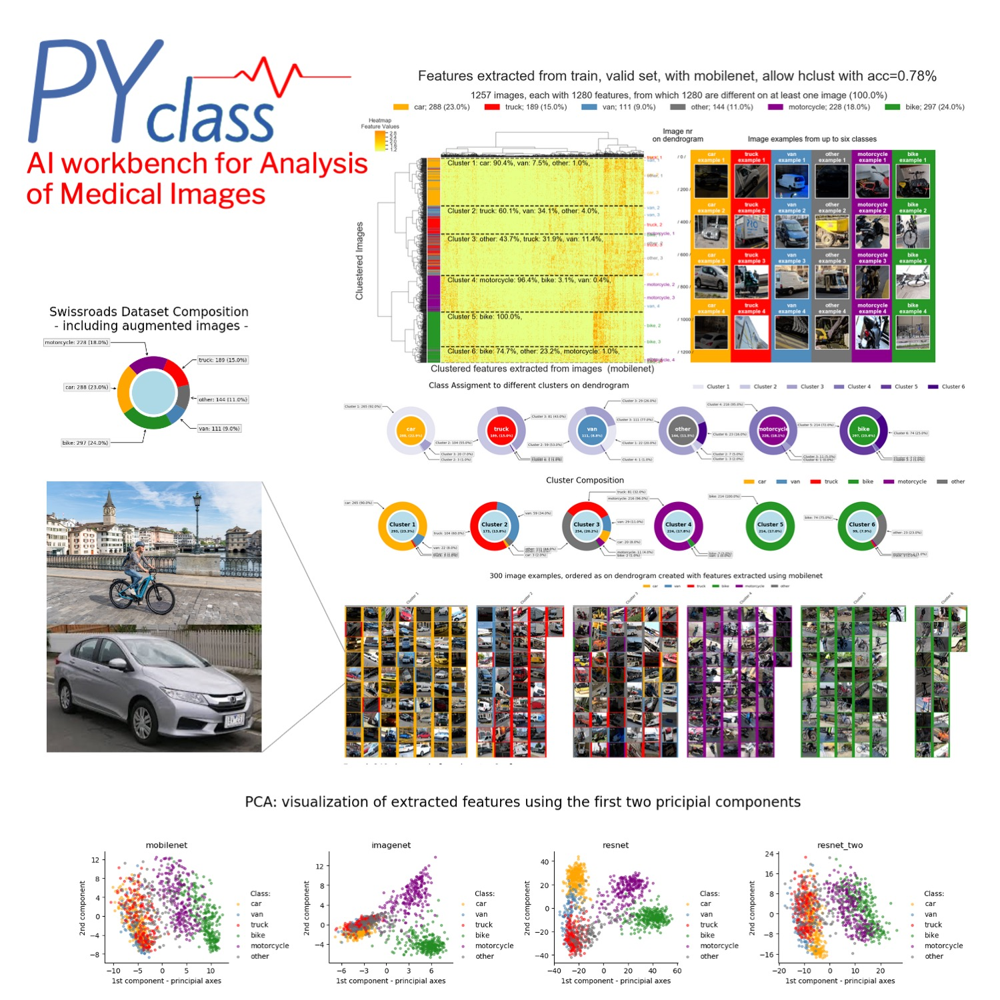

 

---
## __FEASIBILITY STUDY__
---

 

### __GitHub project:__ Feasibility study presented in this repository   
Notebooks presented in this repository are part of feasibility study conducted for SkinDiagnosticAI initiative. The study was conducted iteratively, in five major steps: 
* __Step 1.__ To create __PyClass__ - an automated piepline for analysis and classysfication of medical images
  * the piepline was developed using Swissroad dataset, that was smalled and easier to analize for non-medical specialist then dermatoscopic images,
  * later on, it was improved with medical images (dermatoscopic of skin cancer, and colon cancer) 
  * PyClass analysis of SwissRoad dataset can be find here: https://github.com/PawelRosikiewicz/Swissroads
  * 
  * __PyClass_provides dashboards for selection of pretrained TF models
  
 

* __Step 2.__ To compare large number of AI models, with different diagnostic purposes using open source data from __Harvard database__ with skin images diagnosed by the group of medical experts
  * speciffic goals were as follow:
    - to identify main challenges with anylsis and classyfication of dermatosciopic images   
    - to explore different strategies for data preparation, treatment and feature extraction,
    - to test, of the shelf AI solutions, with extensive grid search, 
    - to develope baseline for further analyses,  and model development  
    - to evaluate what statistics and error fucntions should be used for developing final, and ensemble models,
    - to compare different methods for results presentation that are most usefull for medical experts and non-medical users
  * SCOPE:
    * in total, over `5000 different models` were evaluated in the project.
    * here, on GiHub repository, I present the shorter version of that project, which allows training and evaluation of `250 selected models` on HAM10000 dataset of skin cancer images. The results from all 5000 models are presented on `slides at the end of this file`. All 5000 models, or more, can be easily retrained and used wiht the current code implementation, after modyfying configuraiton files for additional parameter values, and model types. 
    * 
    * 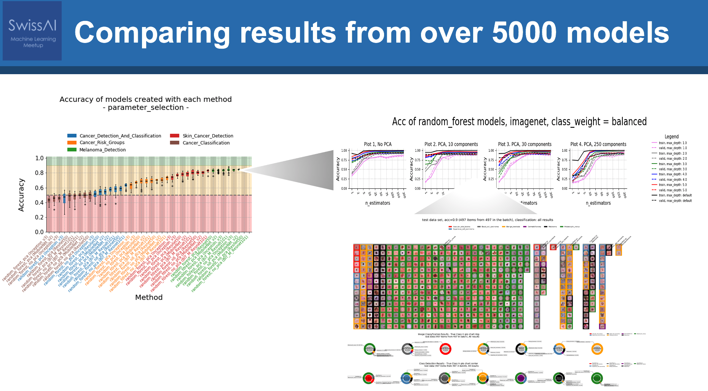
     * 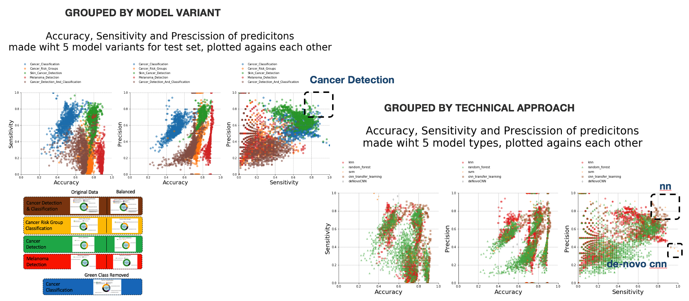 

  
  * > NOTE: selected models and PyClass outputs can be used as __Proof Of Concept__, or an __early stage MVP__, thanks to reporting capability of the PyClass on the medical data

 

* __Step 3.__ to evaluate __business value proposition__ of different models, and consult them with users and domain experts

 

* __Step 4.__ __to deploy the pipeline__ with selected models on the cloud, and use it as __Proof of Concept__ produc, that can be used to generate actionable results, 
  * > NOTE: `Steps. ` to 4 were conducted iteratively, several times`

 

* __Step 5.__ to perform __AI readiness assesment__, and to collect a set of final requirements for potential MVP
  * > NOTE: preliminary buisness proposal, ai feasibility assement, and  was create before stage 1. Here we used used the knowledge collected in feasibility study to update opur estimates,

#### __What is in this GitHub repository?__
The notebooks, and software presented in this repository were used to conduct Steps 1-3, of the SkinDiagnosticAI feasibility study. The `slides`attached below the text show results from all steps 1-5

### __About PyClass__
PyClass is an open-sourse, AI workbench for development of classyficiton models for medical images, and evaluation of medical datasets.

It's main functionalities are:
* Data preparation:
  * cleaning, filtering, format validation
  * preration sorted datasets for keras image generators
  * feature extraction with pre-trained convolution networks
* EDA, on medical images,
  * PyClass allows viewing large number of medical images with its label, and additional information, that is consistent on different visualizations. Thus, allowing for results interpretation to non-medical specialist.
  * all visualiazations, have automated annotatotaion of the data, 
* Model Traing, selection and evaluation
  * Pyclass provides the __smart grid search__ fucntion that allow traingin and selection of large number of models automatically, 
  * subsequently, the models, can be compared and evaluated wiht the same test dataset, and different statistics, without re-running the models, 
  * Model optimization,   
* Error analysis, 
  * PyClass allows to compare models on three levels of granularity, 
    * results obtained with different models, eg cnn and knn 
    * effects of diffeetn parameters on results obtained with group of similar models, 
    * classyfication results obtained with eahc individual model
  * all three levels provide extensive visualizations and table-reports on the results,
* baseline selection,
* datasets cleaning

* > Note: PyClass, was developed using only basic, python libraries, such as scipy, tensofrflow, and matplolib, and can be used with any version of python >3.6. See how PyClass was used for develoment of reliable classification models of vehicles on roads https://github.com/PawelRosikiewicz/Swissroads

* __Fig.__ Examples of results generatzed with Pyclass fro SkinDiagnosticAI project, used to evaluate feature extraction cnn modules from tf-hub, 
* 

 

---
## __SkinDiagnosticAI - Feasibility Study__
---

 

### __Before you start__
* Clone repository
* [create conda enviroment](https://conda.io/projects/conda/en/latest/user-guide/tasks/manage-environments.html#creating-an-environment-with-commands)
  * use __`src/env/skindiagnosticai_conda.ylm`__
* [install Jupiter labs](https://jupyterlab.readthedocs.io/en/stable/getting_started/installation.html)
  * > NOTE: PyClass should work without creating conda enviroment, both on Jupyter Lab nad Jupupiter Notebook, You may need to instal several packages. 
* Subsequently, follow the intruction below, to repeat the analysis
* all functions shoudl have help() available
* IMPORTANT: You may also run the same scripts on `interactive session` in Renku platform, (Swiss Data Science Center), without any installation. See instruction below

 

### __- 1 - Download the data, and PyClass Setup__

 

* __Download the data__ 
  * __HAM10000 dataset__, it is a large collection of multi-source dermatoscopic images (100015 images) of common pigmented skin lesions, that have 7 classes of images, labelled by medical experts, 
  * __Source__ : [LINK](https://dataverse.harvard.edu/dataset.xhtml?persistentId=doi:10.7910/DVN/DBW86T)
  * __Size__; Apoprox 3GB
  * __Dataset Version__; HAM10000 dataset, has only one version, at the time of this project development, that was published in 2018.
  * __License__; Non-Commercial purposes only, 

 

* __01. Setup PyClass enviroment__
    * NOTEBOOK: __`project_setup/01_Setup.ipynb`__ 
    * in this step you will:
      * Setting Up Project Enviroment with proper directory structure
      * clone/download PyClass repository, 
      * Download the data, and tf-hub models for feature extraction (optional)
      * Prepare config files for the project
        * `tfhub_configs.py`: configs on tf hub modules used for feature extraction
        * `project_configs.py`: basic description of the dataset
        * `dataset_configs.py`: contains dictionaries used to label images in each class, provide colors etc, select classes for cutom statistics, etc,,
        * `config_functions.py`: special functions used to select files for data processing and module training,
    > NOTE: each config file contains detailed intrsuctions, on how to create them, 

 

* __02. Data Preparation__
    * NOTEBOOK: __`project_setup/02_[a:c]_Data_Preparation.ipynb`__
      * and: __`01_Data_Preparation.ipynb`__ 
    * in this step you will
      * perform quick EDA on raw data, 
        > IMPORTANT: `IMAGE EXAMPLES FROM EACH CLASS`are in 02_EDA.ipynb`, in order to keep this notebook relatively small 
      * you will prepare summary table with names and classes of filtered images (eg with no missing data) and all associated metadata that will be used lateron with PyClass to build different classyficaiton models
    * it includes, donwloading the images fron Harvard dataverse, or Kaggle, (links are in notebooks)
    * cleaning, the images, and organizing in train/test/valid folders, with separate folders containg images from each class, named after class name
    * dividing large dataset into smaller subsets, or 
    * __Caution__ data used for de-novo cnn models, are not divided into smaller subsets, these are kept in one folder to allow keras image generators creating augmented images, while trainign the model

  

* __03. Feature extraction__
    * NOTEBOOK: __`project_setup/03_Feature_Extraction.ipynb`__
    * PyClass provides you with two options, to build classyficaiton models
      * a) use`ne-novo cnn networks` for classyficaiton of images, 
      * b) use of the shelf solutions provided by `skilearn, keras, and tensorFlow`, with features extracted using pretrained convolutional networks, downloaded from tf-hub, or other location.
    * to extract features follow the instructions in `project_setup/03_a-c... notebook`
    * models: 
        * option 1. PyClass may donwload the model from tf-hub directly, with url,
          > not hoever, that this solution may depend on quality of the internet connection, and the modle may need to be donwloaded several times if you repeat the analyis,
        * option 2. you may donwload the model to `model/` directory, and use it with the same function
        * PyClass will work with any number of models 
    * __Caution__: model name, and potential url must be added to tfhub_configs.py (see instruction in the file directly)

 

*  > NOTE: current code examples can be run as is, all configs and data were already prepared for You. If you would like to create `your own project wiht PyClass`, or add more models and conditions to SkinDiagnosticAI project, you need modify, configuration file, and potentiall, donwload preffered models for Tensorflow-hub. Detailed instruction are in `project_setup/01 - 03 ... notebooks`

 

### __- 2 - EDA with PyClass for SkinDiagnosticAI__

* > PyClass provides automated several functions for EDA, that were presented in the notebooks. All funciton have `help()` available and  can be used to any image dataset with large number of images, in a limited number of classes.

* __EDA GOALS:__
  * __1. To answer following questions__
    * what is the composition of the dataset?
    * does different classes have similar size? 
    * can we find hidden subclasses, and if yes, are they well represented, 
    * are there some obvious problems with the dataset
    * do I have sufficient number of images for making image classyfication
    * why some classes are imbalanced (if they are)            
                            
  * __2. To plot image examples from each class__
    * image examples are provided with several other functions, or separately, with the function `plot_n_image_examples`, as below
                     
  * __3. Technical Exploration__  
    * to compare results of feature extraction using
      * hierarchical clustering with examples, 
      * PCA
  * to understand what preprocessing steps, can be required to bild the most optimal baseline, tranfer learning and deep learnign models,   
 

* #### __Fig 1.__ Example of results generated with PyClass for images sampled from HAM1000 dataset, grouped into 7 classes of skin changes, including 6 different types odf skin cancer (`Cancer Detection and Classyfication model`)

* #### __Fig 2.__ Example of results generated with PyClass for images sampled from HAM1000 dataset, grouped into 3 classes of skin changes, presenting low, medium, and high risk of becoming metastatic cancer (`Cancer Risk Groups model`).

* #### __Fig 3.__ `PyClass Panel for selection of feature extraction models`, that allows clustering images with features extracted using pretrained cnn. By default, the classyfication searches the same number of calsses, as in the raw data, but it can be set to any number, in order to identify hidden clusters of images, or cluster of images with similar features. Ideally, feature extraction module, shodul allow separating each class into separate cluster, and provides unique features, visible on a heatmap. in addition, PyClass allows sample images in each cluster, or use the clustering to display images classified with other models. 

 

---
## __RUN  THE ANALYSIS IN INTERACTIVE ENVIROMENT WIOTHOUT INSTALLATION OF ANY SOFTWARE__
---

 

### __to play with the code, follow these instructions:__
* Got to: SkinDiagnosticAI, with PyClass implemented at SDCS  
  https://renkulab.io/projects/swissai/amld-2021-workshop
* Click on `Environments`
* Start new interactive environment (Click on `NEW`)
* in new window, set following parameters:
  * Number of CPUs: 2
  * Amount of Memory: 2G
  * leave branch, commit and Def. Environment as they are,
* Click on `Start Environment` button (below all parameters)
  * you may wait for preparation of the environment
* Click `Connect` (blue button on the left)
* Now, you should be connected to virtual environment with Jupiter lab open
* Notebooks 1-4 are in “notebook” folder
  * you may open and try each of them, 
  * all functions, and coffings are in “src” directory 
  * the files were annotated, with instructions how to modify them, 
  * The code was explained on my workshop @AMLD: 
* follow the instreuctions withint each notebook, 
  * all functions have help available ... help(<function_name>)
  

 

---
## __Presentation on SkinDiagnosticAI Project__
---

 

* the slides shows full analyis done on over 5000 compared models and data treatment procedures, 
* Jupyter notebooks in notebook folder shows light vervion of that analyis that can be reapeated by the user and build up to any number of compared models, 
* for more information see: My presentation on SkinDiagnosticAI project: https://youtu.be/W624gdkDqRQ?t=491

> all images were created wiht PyClass AI workbech

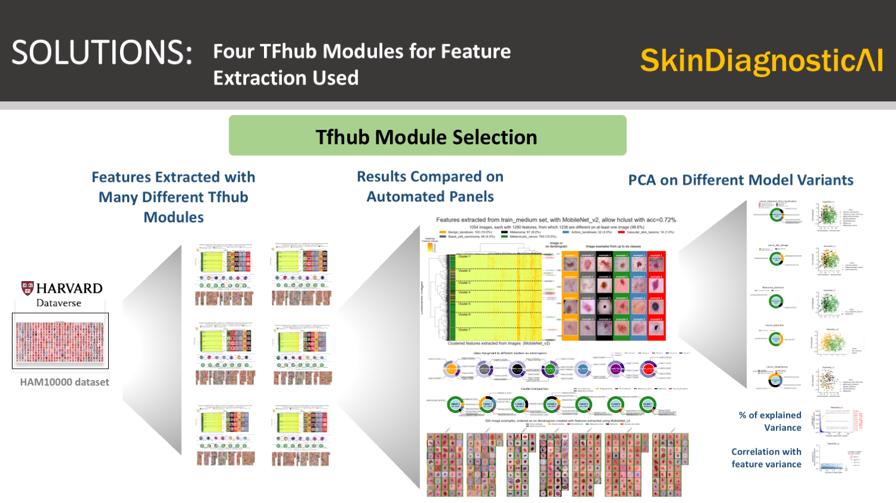
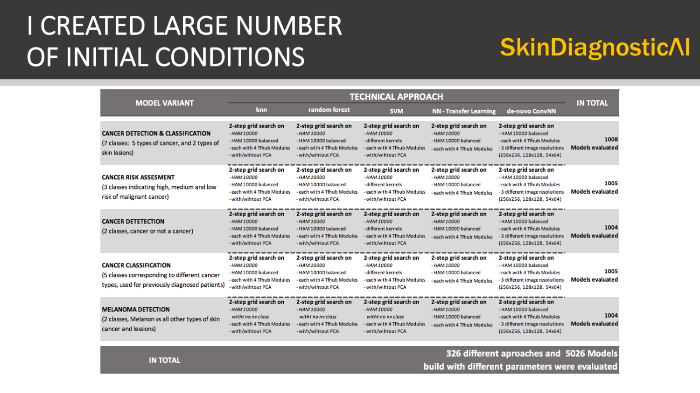

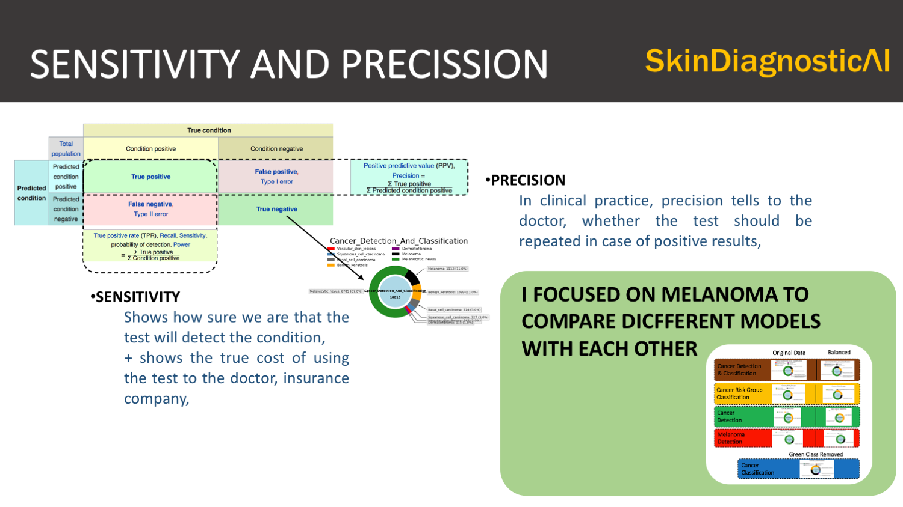

