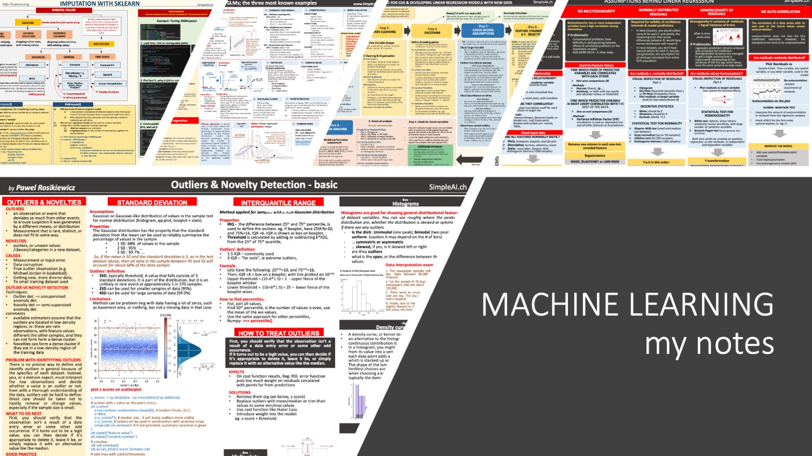
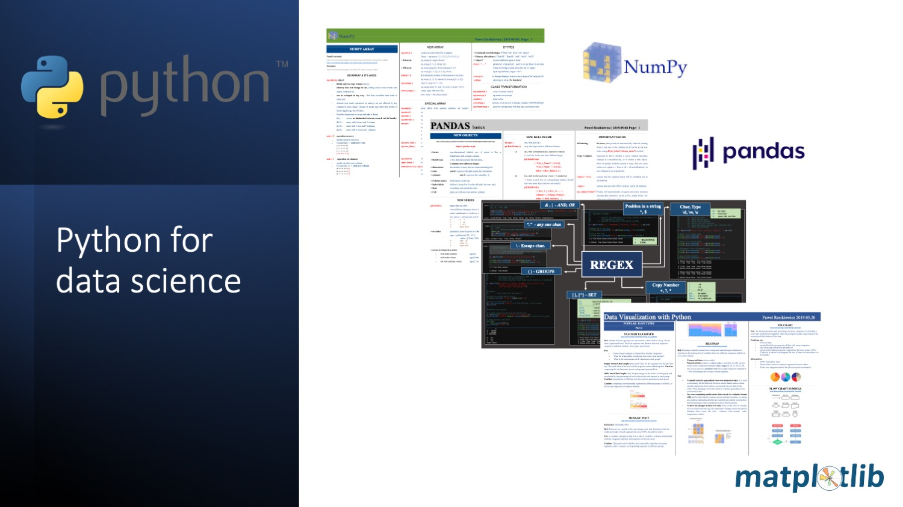

# MachineLearning
Created by __Pawel Rosikiewicz__, Data Scientists, Product developer, AI educator, Python 
more on my projects at: www.SimpleAI.ch
my meetup: www.SwissAI.org
my channel on youtube: https://www.youtube.com/c/SwissAI

## ABSTRACT   
Here, you can find materials that I created to teach intermediate Python, Machine Leanring, Business Analytics, and Data Science to enterprize employes.
Larger projects, such as __PriceHook__, __analysis of Food Labels__, or __SkinDiagnosticAI__, ie how to create successful AI project in Heahtcare, are in separate folders, with all corresponding description.

## CONTENT

### __MY NOTES__   

1. __Machine Leanring Notes__   
   a. cheat sheets on topics like, Linear regression with short code examples.  
   b. Processes that I use for EDA, and data preparation for AI models  
   c. packages helpers: eg how to build a pipeline with sklearn  
   d. theoretical topics, eg. growth curves, correlation analysis regularization,     

### __CODE EXAMPLES__   

1. __Machine Leanring code examples__      
   Here, i places jupyter notebooks, presenting most frequently used techniques in machine learning. Each notebook starts with theoretical introduction, followed with several code examples, and my comments.
2. __Data Vizualization - code examples__     
   a. basic introduction to plots with python   
   b. code example how to create great vizualizations with Matplolib, and seaborn  
6. __Statistics - currently under development__  

### __INTRODUCTION TO PROGRAMMING__   

1. __Python__   
    a. my leanring materials on intermediate python   
    b. packages: Python data structures, Numpy, Pandas, Matplotlib, Request,   
    c. selected topics: Random number generators, regex functions,   
2. __R__     
   my mini course on how to use basic funcitons in R  

